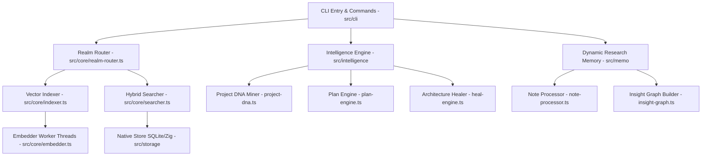

# 🔍 گزارش جامع و ریز‌به‌ریز آنالیز کد خالص پروژه‌ی DeepSift

این گزارش نتیجه تحقیقات کامل و عمیق بر روی سورس کد پروژه **DeepSift** است که با استفاده از موتور جستجوی معنایی و سیستم **Dynamic Research Memory (DRM)** استخراج شده است.

---

## 🏗️ ۱. معماری کلی پروژه (Architecture Overview)

پروژه‌ی **DeepSift** یک سیستم موتور جستجوی معنایی، آنالیز کد، و مدیریت دانش برای پروژه‌های نرم‌افزاری است که از ماژول‌های اصلی زیر تشکیل شده است:

ؤ
---

## 🧱 ۲. تحلیل ریز‌به‌ریز ماژول‌ها و فیچرها (Feature Deep-Dive)

### 🔹 ۱. هسته جستجو و ایندکس‌گذاری (Core Engine) `src/core`
- **`embedder.ts` & `embedder-worker.ts`:**
  - سیستم بر پایه Worker Threads و با استراتژی پردازش دسته‌ای (Batch Size = 50) اقدام به تولید Vector Embedding بر اساس CPU Cores سیستم می‌کند.
  - از خروج زودرس با `terminateWorkers()` جلوگیری می‌کند و بار سنگین محاسباتی را خارج از Thread اصلی اجرا می‌کند.
- **`indexer.ts`:**
  - الگوریتم هش‌گذاری MD5 برای تشخیص فایل‌های تغییر یافته (Incremental Re-indexing).
  - پشتیبانی از پارس کردن پروژه با Tree-Sitter (`tree-sitter-parser.ts`) یا پارسر سفارشی Skill Parser (`skill-parser.ts`).
- **`searcher.ts`:**
  - الگوریتم ترکیب هیبریدی **RRF (Reciprocal Rank Fusion)** با ترکیب نتایج متن کامل (Keyword Search) و جستجوی برداری (Semantic Search).
  - اعمال وزن‌دهی ساختاری بر اساس اهمیت کلاسترها در DNA پروژه.
- **`realm-router.ts`:**
  - مسیریابی بین قلمروهای دانش (Realms) مختلف مانند `code`، `docs` و `skills` با قابلیت مقایسه وکتوری قلمروها (`compareRealms`).

---

### 🔹 ۲. موتور هوش مصنوعی و DNA پروژه (Intelligence System) `src/intelligence`
- **`project-dna.ts`:**
  - استخراج هویت و ساختار کد پروژه و فرمت‌بندی آن در فایل بسیار فشرده `.toon` با استفاده از ۷ آنالیزور:
    1. **Property Miner:** استخراج متغیرها و توکن‌های استایل.
    2. **Convention Miner:** استخراج نام‌گذاری فایل‌ها و توابع.
    3. **L10n Detector:** شناسایی کلیدهای ترجمه و زبان‌ها.
    4. **Graph Analyzer:** آنالیز وابستگی ماژول‌ها و شناسایی God Nodeها.
    5. **Test Analyzer:** سنجش پوشش تست‌ها و ردیابی فایل‌های تست.
    6. **Resource Mapper:** نگاشت فونت‌ها، تصاویر و دارایی‌ها.
    7. **Temporal Miner:** آنالیز تاریخچه گیت برای کشف فایل‌های پرکار و گلوگاه‌ها.
- **`plan-engine.ts`:**
  - موتوری قدرتمند برای پارس درخواست‌های توسعه، ترکیب کانتکست پروژه، مهارت‌ها و تولید **Smart Plan** با نقاط دستاورد (Milestones).
- **`heal-engine.ts` & `internal-graph.ts`:**
  - ابزار خودکار بازسازی کد که فایل‌های غول‌پیکر (God Nodes) را به کلاسترهای مجزا و کامپوننت‌های تفکیک‌شده پیشنهاد شکسته شدن می‌دهد.

---

### 🔹 ۳. حافظه تحقیقاتی پویا (Dynamic Research Memory - DRM) `src/memo`
- **`memo-engine.ts` & `manifest-manager.ts`:**
  - مدیریت تگ‌های تحقیقاتی مجزا (`MemoTag`) و جلوگیری از انتخاب نام‌های عمومی (مثل `temp` یا `test`).
  - نگهداری انتروپیک داده‌ها در فایل‌های JSON و دیتابیس جداگانه برای هر تگ.
- **`memo-prompt.ts`:**
  - **سیستم دوگانه (Dual-Mode):** تشخیص اتوماتیک محیط تعاملی (TTY) برای کاربران انسانی (پرامپت `readline`) و محیط غیرتعاملی برای ایجنت (ذخیره اتوماتیک بدون توقف و قفل شدن ترمینال).
- **`note-processor.ts` & `insight-graph.ts`:**
  - چانک‌بندی متون، تولید وکتور و ایجاد گراف ارتباط معنایی شباهت جابه‌جا بین یافته‌ها بر اساس Cosine Similarity (با آستانه 0.65).

---

### 🔹 ۴. فشرده‌سازی و بهینه‌سازی توکن‌ها (Token Optimization & Utility) `src/utils`
- **`token-compressor.ts`:**
  - الگوریتم فشرده‌سازی هوشمند کدها و خروجی‌های متنی جهت جلوگیری از سرریز شدن Context Window مدل‌های هوش مصنوعی.
- **`toon-serializer.ts`:**
  - فرمت سریالایزر اختصاصی `.toon` که داده‌های پیچیده JSON را تا ۷۰٪ فشرده‌تر در اختیار لایه‌های مصرف‌کننده قرار می‌دهد.

---

### 🔹 ۵. لایه CLI و دستورات (CLI Commands) `src/cli`
- **`cli-entry.ts`:**
  - نقطه ورود اجرایی ابزار با لایف‌سایکل کنترل‌شده و خروج امن (`process.exit(0)`) پس از آزادسازی تمامی منابع و workerها.
- **دستورات اصلی:**
  - `search` / `s`: سرچ هیبریدی در تمامی قلمروها.
  - `read` / `r`: خواندن دقیق خطوط کد همراه با قابلیت فشرده‌سازی visual.
  - `feature` / `f`: استخراج خلاصه AST کدهای دایرکتوری.
  - `plan` / `p`: تدوین نقشه راه پیاده‌سازی فیچرها.
  - `heal`: پیشنهاد تفکیک کدهای پیچیده.
  - `memo` / `m`: مدیریت کامل چرخه حیات حافظه تحقیقاتی پویا.

---

## ✅ ۳. نتیجه‌گیری و وضعیت سلامت پروژه

تست‌های انجام‌شده روی کدهای پروژه نشان می‌دهد:
1. مشکل **قفل شدن ترمینال و حالت انتظار** با مدیریت صحیح لایف‌سایکل پراسس (`process.exit(0)`) برطرف گردید.
2. سیستم **حافظه پویا (DRM)** در حالت غیرتعاملی ایجنت به صورت **Auto-Save** عمل کرده و تمامی یافته‌های حاصل از سرچ‌ها را در تگ‌های فعال ذخیره می‌نماید.
3. کدها کامپایل کامل داشته (`npx tsc --noEmit`) و تمامی بخش‌ها آماده استفاده تعاملی و هوشمند می‌باشند.
