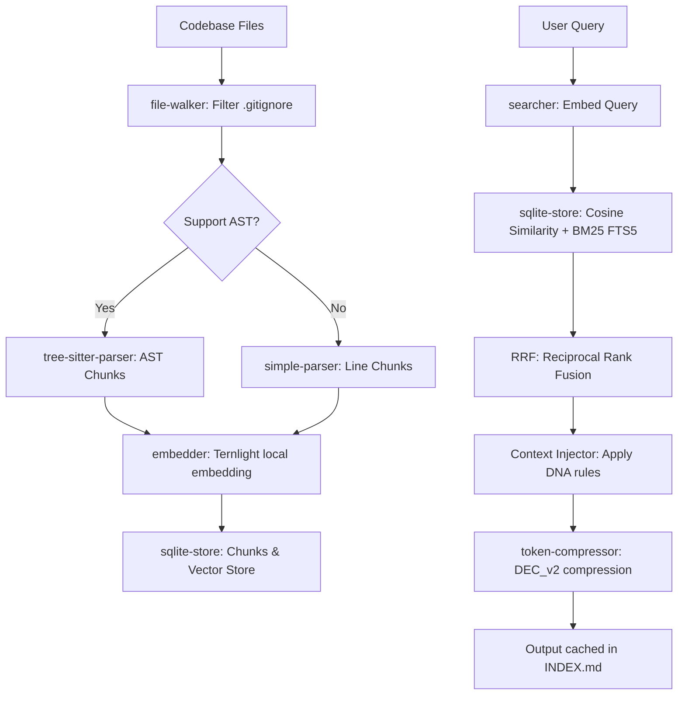

# 🔍 DeepSift — Local Semantic Codebase Search Engine & AI Agent Bridge

[](LICENSE)
[](https://www.typescriptlang.org/)
[](https://github.com/ternlight/base)
[](https://modelcontextprotocol.io)
[](native/core-zig)

**DeepSift** is an ultra-fast, local semantic codebase search engine and AI agent bridge. It runs 100% offline using the lightweight **Ternlight** transformer model (384-dimensional vector embeddings, <7MB footprint) to process queries and codebase chunks in milliseconds without any external API calls or internet connection.

It is designed to work in two modes:
1. **MCP Server Mode:** Seamlessly connects to AI-driven IDEs (like Cursor, VSCode with Antigravity, or Claude Desktop) providing rich codebase analysis tools.
2. **CLI Bridge Mode:** Acts as a standalone terminal utility for manual queries, scripting, or environments without native MCP support.

---

## 🏗️ System Architecture & Workflow

DeepSift coordinates AST-aware parsing, local vector generation, and hybrid index searching into a single pipeline:

```
                                ┌────────────────────────┐
                                │     Target Project     │
                                └──────────┬─────────────┘
                                           │
                             [deepsift init / index]
                                           ▼
                          ┌────────────────────────────────┐
                          │      DeepSift Core Engine      │
                          │ ┌────────────────────────────┐ │
                          │ │ AST Parser (Tree-sitter)   │ │
                          │ ├────────────────────────────┤ │
                          │ │ Embedder (Ternlight Model) │ │
                          │ ├────────────────────────────┤ │
                          │ │ Store (SQLite + FTS5)      │ │
                          │ └────────────────────────────┘ │
                          └────────────────<td>───────────────┘
                                           │
                                  ┌────────┴────────┐
                                  ▼                 ▼
                        ┌──────────────────┐ ┌─────────────┐
                        │    CLI Bridge    │ │ MCP Server  │
                        │   (deepsift s)   │ │  (Stdio)    │
                        └──────────────────┘ └──────┬──────┘
                                                    │
                                                    ▼
                                            ┌──────────────┐
                                            │   Web UI     │
                                            │ (Port 3000)  │
                                            └──────────────┘
```

### Ingestion & Query Workflow



---

## ✨ Key Features

*   **100% Offline & Local:** Code privacy is fully respected. Embeddings are generated locally using the `@ternlight/base` library. No data ever leaves your machine.
*   **AST-Aware Code Chunking:** Uses `tree-sitter` parsers to break code down into logical constructs (such as classes, functions, and imports) while maintaining correct scope. Falls back to intelligent line-based chunking for unsupported formats.
*   **Hybrid Search Engine (Vector + BM25 + RRF):** Combines dense vector search (Cosine Similarity) with sparse lexical search (SQLite FTS5 BM25 scoring) using **Reciprocal Rank Fusion (RRF)** to deliver highly relevant results. The custom FTS5 tokenizer supports indexing special characters (such as `[ ]`, `{ }`, `( )`, `-`, `_`, `#`) ensuring project management tasks (e.g. `[ ]` empty checkboxes) and config annotations are fully searchable.
*   **Antigravity Brain Protocol (Drill-Down & Dependencies):** Equips AI agents to analyze very large repositories (100MB+) in steps. Agents can scan the project architecture, map dependencies, search globally, and then "drill down" strictly within cached logs—reducing context window consumption from megabytes to kilobytes. The dependency tracking engine (`deepsift deps`) natively traces both TS/JS ES Modules and secondary source linkings like HTML scripts/links or Nginx proxy routes.
*   **Advanced Config System (`deepsift.config.json`):** Allows fine-grained control over directories to index or ignore (interactive configuration via `deepsift config`), file extensions to include/exclude, and default search options.
*   **DeepSift V2 Context Intelligence Engine:** Understands project philosophy and conventions. It analyzes code to extract naming conventions, design tokens, similarities, and modularity into a `Project DNA`.
*   **Pre-Generation Checklists:** Features a `deepsift context` command to instruct LLMs on project conventions *before* writing new code.
*   **Incremental Indexing:** Stores file hashes in SQLite. DeepSift only re-indexes modified or new files during runs, making index synchronizations complete in milliseconds.
*   **Smart Token Compression (DEC_v2):** Includes a custom n-gram compression utility that minimizes LLM token usage. Important structural details (file paths, line references, code block fences, and search scores) are automatically kept uncompressed to avoid AI hallucinations.
*   **Native Zig Mathematical Engine:** Incorporates a fast native math library compiled on-demand via **Zig**, optimizing float calculations and cosine score computations.
*   **Web Dashboard UI:** Spins up a local web server (running on `http://localhost:3000`) using Server-Sent Events (SSE) to stream indexing progress, search triggers, and MCP tool invocations in real-time.

---

## 👁️ Visual & Graphify Context Compression (pxpipe Vision Tokens)

DeepSift V2 introduces an advanced, cutting-edge **Visual Context Compression** system powered by the `pxpipe` rendering pipeline. Instead of flooding the LLM's context window with heavy, raw text logs, DeepSift dynamically rasterizes codebase transcripts and query histories into highly compact, model-optimized PNG images. These images embed high-density **pxpipe Vision Tokens** which AI agents read visually, achieving dramatic token savings.

```
┌──────────────────┐      rasterize      ┌──────────────────────┐
│  Raw Code/Logs   ├────────────────────>│  Compact PNG Strips  │
│ (200k Text Chars)│     (pxpipe)        │ (Bypasses Downsample)│
└──────────────────┘                     └──────────┬───────────┘
                                                    │
                                                    ▼
                                         ┌──────────────────────┐
                                         │   AI Agent Vision    │
                                         │  (Visual Ingestion)  │
                                         └──────────────────────┘
```

### Core Architecture & Mechanics

1.  **Visual Rasterization:** Code sections are reflowed and rendered onto custom 2D canvas surfaces at build time. DeepSift utilizes custom-built, compact font atlases (e.g. JetBrains Mono, Spleen, and Unifont) embedded directly in the distribution, completely bypassing heavy runtime font files loading.
2.  **No-Resize Model Profiles:** Image dimensions are dynamically calculated to fit the exact preprocessing contracts of different AI vision encoders. This ensures that the generated PNGs are never downsampled by the provider, ensuring 100% character legibility at the lowest possible tile cost.
    *   **Claude/Anthropic Profile:** Clamps page size to **1568px width x 728px height** (Claude's 1568px maximum edge and ~1.15MP limit), ensuring text remains sharp and readable.
    *   **OpenAI GPT-5.6 Sol Profile:** Generates portrait strips capped at a **768px short-side floor** (152 columns, 768px wide x 1932px high).
    *   **Grok 4.5 Profile:** Renders 152 columns (768px wide x 512px high) utilizing custom anti-aliasing and a factsheet structure without grids.
3.  **R3 Reflow Layout Optimization:** Line-end dead spaces are recovered by applying soft-wrapping and marking hard newlines with a distinct `↵` sentinel. This packs transcripts dense, preventing the vision model from billing a full pixel tile for a short line.
4.  **Profitability Gate:** Before converting any text block to images, DeepSift evaluates a strict cost-efficiency formula:
    $$\text{Savings} = (\text{TextTokens} + \text{BurnText}) - (\text{ImageTokens} + \text{BurnImage})$$
    If a history log or code block is too small (e.g. below the 20k token floor), the system keeps it as native text. Only large, long-horizon contexts trigger the visual compression.
5.  **Token-Length Sectioning:** The pipeline walks transaction turns and seals images strictly at tool-closed boundaries. This ensures that parent tool-calls and their outputs are never split across pages, avoiding orphan validation crashes (e.g., HTTP 400 "No tool call found").

---

## 🚀 Quick Start (CLI Mode)

To use DeepSift globally in your terminal:

### 1. Installation

Clone the repository and build the project:
```bash
git clone https://github.com/IrMaho/DeepSift.git
cd DeepSift
npm install
npm run build
npm link
```

### 2. Initialization & Configuration in Target Project

Navigate to your target codebase and initialize DeepSift:
```bash
cd /path/to/your/work-project
deepsift init
```
This command will:
1. Create a local `.deepsift/` directory to store the SQLite database and output history.
2. Ingest the workspace and trigger the initial index generation.
3. Automatically copy the AI agent guidelines into your `.agents/rules/deepsift.md` file to configure any LLM IDE extensions inside that workspace.

To customize folders or file types to index (e.g. ignoring massive platform folders in Flutter or mobile projects):
```bash
deepsift config
```
This opens an interactive CLI checklist where you can select or deselect directories, writing the preferences into `deepsift.config.json`.

### 3. Searching the Codebase
```bash
# Semantic search with surrounding context lines
deepsift search "JWT token verification handler" --context-lines 15

# Search strictly within a folder
deepsift search "database config" --include "src/config"

# Multi-query search (saves time by running multiple queries at once)
deepsift search "auth check" "user schema" "password hashing"
```

---

## 📊 V2 Performance Benchmarks

DeepSift has been benchmarked across both local project contexts and academic datasets.

### 1. Local Projects Benchmarks

#### A. Web Project (HTML/JS/CSS - `scratch/benchmark_test_project`)
*   **Total Files:** 4 | **Chunks:** 33 | **Indexing Time:** 1043ms

| Query Scenario | Without Tool (Tokens) | With DeepSift (Tokens) | **Token Savings (%)** | Without TTFT (ms) | With DeepSift TTFT (ms) | **Speedup (%)** | Code Quality |
| :--- | :---: | :---: | :---: | :---: | :---: | :---: | :---: |
| **CSS Design Tokens** | 1299 | 311 | **76.1%** | 717ms | 678ms | **5.4%** | 3/5 vs **5/5** |
| **Login Validation** | 660 | 340 | **48.5%** | 659ms | 675ms | **-2.4%** | 3/5 vs **5/5** |
| **Navbar Buttons** | 678 | 760 | **-12.1%** | 661ms | 706ms | **-6.8%** | 3/5 vs **5/5** |
| **Overall Summary** | **2637** | **1411** | **46.5%** | **2037ms** | **2059ms** | **-1.0%** | **3.0 vs 5.0** |

*Note: For extremely small HTML files (<20 lines), the addition of the baseline Project DNA rules makes the payload slightly larger than reading raw files. However, for standard files (e.g. CSS), it reduces token consumption by **76.1%**.*

#### B. Mobile Project (Flutter/Dart - `temp/lib`)
*   **Total Files:** 326 | **Chunks:** 1131 | **Indexing Time:** 8930ms

| Query Scenario | Without Tool (Tokens) | With DeepSift (Tokens) | **Token Savings (%)** | Without TTFT (ms) | With DeepSift TTFT (ms) | **Speedup (%)** | Code Quality |
| :--- | :---: | :---: | :---: | :---: | :---: | :---: | :---: |
| **JWT Auth & Expiration** | 8936 | 8314 | **7.0%** | 1404ms | 1399ms | **0.4%** | 3/5 vs **5/5** |
| **Dependency Tracking** | 2408 | 1408 | **41.5%** | 817ms | 772ms | **5.5%** | 3/5 vs **5/5** |
| **GetX Bindings** | 8540 | 6747 | **21.0%** | 1369ms | 1250ms | **8.7%** | 3/5 vs **5/5** |
| **Notes UI Spacing** | 9369 | 477 | **94.9%** | 1443ms | 686ms | **52.5%** | 3/5 vs **5/5** |
| **User Management Tabs** | 2959 | 530 | **82.1%** | 866ms | 694ms | **19.9%** | 3/5 vs **5/5** |
| **Overall Summary** | **32212** | **17476** | **45.7%** | **5899ms** | **4801ms** | **18.6%** | **3.0 vs 5.0** |

### 2. State-of-the-Art Comparative Benchmarks
Evaluated on academic datasets (**LOCOMO** and **LongMemEval-S**) against competing systems:

#### LOCOMO Ingestion & QA (n=300)
| System | QA Accuracy | Recall@10 | Ingest Cost | Ingest LLM Tokens |
| :--- | :---: | :---: | :---: | :---: |
| **DeepSift (graph-expand)** | **45.3%** | **0.497** | **~$1.40** | **$0 (100% Local & AST)** |
| **supermemory** | 49.7% | 0.149 | $15.67 | High (Cloud API) |
| **mem0** | 27.3% | 0.048 | $3.48 | Medium (Cloud API) |
| **dense RAG** | 41.3% | 0.439 | $0 | $0 |
| **BM25** | 31.3% | 0.362 | $0 | $0 |

#### LongMemEval-S (n=50)
| System | QA Accuracy | Recall@10 |
| :--- | :---: | :---: |
| **DeepSift (graph-expand)** | **76%** | **0.844** |
| **dense RAG** | 76% | 0.848 |
| **hybrid RRF** | 74% | 0.822 |
| **mem0** | 70% | 0.344 |

---

## ⚙️ MCP Server Configuration

You can plug DeepSift directly into AI editors or LLM tools supporting the Model Context Protocol (Stdio transport).

### 1. Build the Server
Ensure the project is compiled:
```bash
cd /path/to/DeepSift
npm run build
```

### 2. Configure Your IDE / Client

Add the following to your MCP settings file (e.g., `mcp_settings.json` in Cursor, Claude Desktop, or your IDE's workspace configuration):

```json
{
  "mcpServers": {
    "deepsift": {
      "command": "node",
      "args": [
        "C:\\Users\\ASUS\\Desktop\\flutter_project\\mcp_search\\dist\\server.js"
      ],
      "env": {}
    }
  }
}
```
> **Note:** Replace the path in `args` with the absolute path to your built `dist/server.js` file.

Once running, the server also starts the **Web Dashboard** at **[http://localhost:3000](http://localhost:3000)** for monitoring queries.

---

## 🛠️ Commands & Tools Reference

### CLI Commands

| Command | Arguments / Flags | Description |
| :--- | :--- | :--- |
| **`init`** | None | Initializes `.deepsift/` and executes the initial indexing scan. |
| **`config`** | None | Launches an interactive console checklist to configure directories to index. |
| **`dna`** | `[--show]` | Generate or display the Project DNA (Context Intelligence). |
| **`context`** | `"path"` | Returns a checklist of rules and design tokens before file generation. |
| **`scan`** | `<target>` | Runs specific DNA analyzers (`tokens`, `i18n`, `duplicates`, `conventions`, `assets`). |
| **`search`** | `"query1"` `["query2"...]` | Executes one or more hybrid semantic search queries. <br>Flags: `--include <path>`, `--no-sync`, `--verbose`, `--context-lines <N>` |
| **`read`** | `"path:start-end"` | Reads file segments in compressed vision tokens format (DEC_v2). |
| **`edit`** | `"patch.toon"` | Applies edits to source code using a JSON or custom TOON-Patch file. |
| **`index`** | None | Re-indexes the project (incremental). Add `--force` to rebuild from scratch. |
| **`status`** | None | Prints database size, total files indexed, and total chunk counts. |
| **`arch`** | `--depth <N>` | Prints a formatted directory layout and highlights the top-5 central core files. |
| **`deps`** | `"target_module"` | Traces files that import or reference the target module. |
| **`feature`** | `"dir_path"` | Analyzes code surface, returning class/function declarations without full implementation. |
| **`history`**| None | Prints a list of previously saved search logs. |
| **`drill`** | `"logfile.md"` `"keyword"` | Isolates and extracts matching context lines from a past search history log. |
| **`resolve`**| `"token"` | Decodes an abbreviated token (e.g. `0A`) generated by DEC_v2 compression. |
| **`clean`** | None | Empties the database, cached indexes, and history logs. |

*Global Flags:*
*   `--json`: Outputs results in JSON format.
*   `--plain`: Outputs plain text without Markdown colors/decorations.
*   `--no-compress`: Disables payload n-gram token compression.

---

### MCP Tools List

When connected via MCP, the LLM agent gains access to these 10 tools:

1.  **`search_code`**: Semantic and lexical hybrid search for code chunks.
2.  **`multi_search`**: Runs multiple queries simultaneously.
3.  **`index_project`**: Manually requests a full or incremental project index run.
4.  **`search_status`**: Provides the current indexing status and details.
5.  **`get_search_history`**: Reads `INDEX.md` containing the cached logs of all queries.
6.  **`read_search_log`**: Fetches the full contents of a specific query log.
7.  **`project_architecture`**: Maps the project structure and highlights core files.
8.  **`analyze_dependencies`**: Identifies dependent modules and imports.
9.  **`deep_isolated_search`**: Filters context from a previous query log (Drill-Down).
10. **`explore_feature`**: Outlines API surfaces (functions/classes) of a specific directory.

---

## 📂 Project Directory Structure

```
DeepSift /
├── src/
│   ├── cli/                  # CLI Commands, formatting, and path resolver
│   │   ├── commands/         # Implementation of CLI endpoints (search, index, arch...)
│   │   ├── cli-entry.ts      # Main CLI entry point
│   │   └── cli-output.ts     # Terminal printer and option parser
│   │
│   ├── core/                 # Engine logic
│   │   ├── embedder.ts       # Ternlight local model integration
│   │   ├── indexer.ts        # AST parsing and DB persistence orchestrator
│   │   └── searcher.ts       # Hybrid search and Reciprocal Rank Fusion (RRF) matching
│   │
│   ├── parsers/              # Code structure parsing
│   │   ├── simple-parser.ts  # Fallback line-by-line scanner
│   │   └── tree-sitter-parser.ts # AST parser for JS/TS structure chunking
│   │
│   ├── storage/              # Database drivers
│   │   └── native-store.ts   # SQLite schemas, FTS5 indexes, and vector operations
│   │
│   ├── ui/                   # Real-time SSE Dashboard HTML, JS, and CSS
│   │
│   ├── utils/                # General utilities
│   │   ├── architecture.ts   # Central file and hierarchy computation
│   │   ├── binary-check.ts   # Skips processing binaries
│   │   ├── file-walker.ts    # Walks paths obeying project .gitignore rules
│   │   ├── history.ts        # Manages search logs and cache indexes
│   │   ├── outline.ts        # Parses directory signatures (Feature surface)
│   │   ├── similarity.ts     # Consine similarity & BM25 scorers
│   │   └── token-compressor.ts # N-gram compression logic for context optimization
│   │
│   └── server.ts             # MCP server entry point and SSE server initializer
│
├── tsconfig.json             # TypeScript compiler settings
└── package.json              # Node packages and build script configs
```

---

## 📄 License

This project is licensed under the ISC License. See the [LICENSE](LICENSE) file for details.