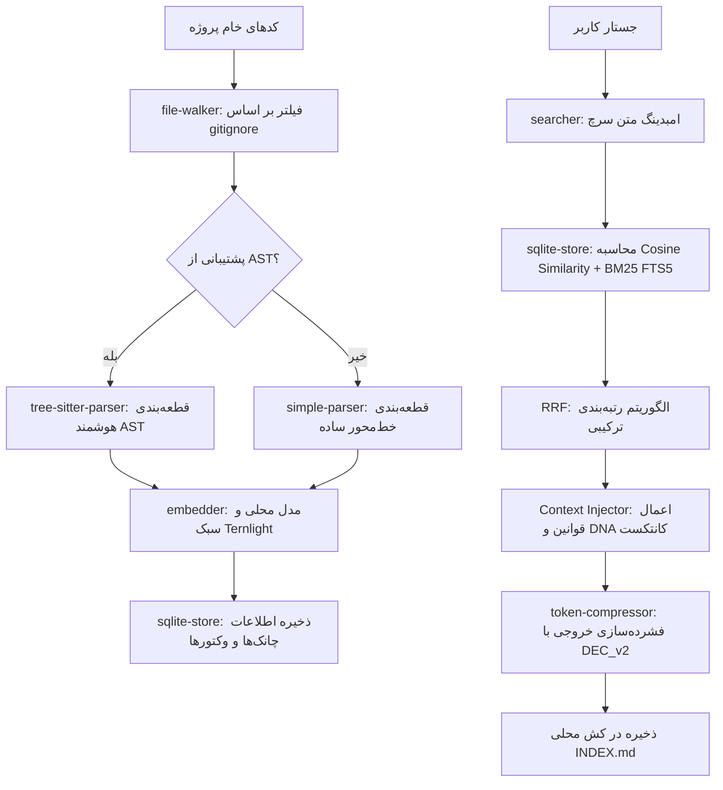

# 🔍 DeepSift — موتور جستجوی معنایی محلی کدها و پل ارتباطی ایجنت‌های هوش مصنوعی

[](LICENSE)
[](https://www.typescriptlang.org/)
[](https://github.com/ternlight/base)
[](https://modelcontextprotocol.io)
[](native/core-zig)

پروژه **DeepSift** یک موتور جستجوی معنایی محلی و فوق‌سریع برای کدهای پروژه و همچنین یک پل ارتباطی پیشرفته برای ایجنت‌های هوش مصنوعی است. این ابزار به صورت ۱۰۰٪ آفلاین و با استفاده از مدل ترنسفورمر سبک **Ternlight** (بردار ۳۸۴ بعدی با حجم کمتر از ۷ مگابایت) کار می‌کند و بدون نیاز به اینترنت یا کلیدهای API خارجی، جستارها و بخش‌های کدهای پروژه را در کسری از ثانیه پردازش و تحلیل می‌نماید.

دیپ‌سیفت در دو حالت زیر قابل استفاده است:
1. **حالت سرور MCP:** اتصال مستقیم و یکپارچه به ادیتورهای هوش مصنوعی (مانند Cursor، VSCode با افزونه Antigravity، یا Claude Desktop) جهت ارائه ابزارهای عمیق تحلیل ساختار پروژه.
2. **حالت CLI (خط فرمان):** ابزاری مستقل در ترمینال جهت اجرای جستجوها به صورت دستی، اسکریپت‌نویسی یا استفاده در محیط‌هایی که فاقد پشتیبانی پیش‌فرض از پروتکل MCP هستند.

---

## 🏗️ معماری سیستم و فرآیندها

دیپ‌سیفت فرآیندهای پارسینگ کدهای منبع بر اساس AST، تولید بردارهای معنایی لوکال، و جستجوی ترکیبی را در یک خط لوله هماهنگ مدیریت می‌کند:

```
                                ┌────────────────────────┐
                                │     Target Project     │
                                └──────────┬─────────────┘
                                           │
                             [deepsift init / index]
                                           ▼
                          ┌────────────────────────────────┐
                          │      DeepSift Core Engine      │
                          │ ┌────────────────────────────┐ │
                          │ │ AST Parser (Tree-sitter)   │ │
                          │ ├────────────────────────────┤ │
                          │ │ Embedder (Ternlight Model) │ │
                          │ ├────────────────────────────┤ │
                          │ │ Store (SQLite + FTS5)      │ │
                          │ └────────────────────────────┘ │
                          └────────────────┬───────────────┘
                                           │
                                  ┌────────┴────────┐
                                  ▼                 ▼
                        ┌──────────────────┐ ┌─────────────┐
                        │    CLI Bridge    │ │ MCP Server  │
                        │   (deepsift s)   │ │  (Stdio)    │
                        └──────────────────┘ └──────┬──────┘
                                                    │
                                                    ▼
                                            ┌──────────────┐
                                            │   Web UI     │
                                            │ (Port 3000)  │
                                            └──────────────┘
```

### خط لوله ایندکس‌سازی و فرآیند پرس‌وجو (Query Workflow)



---

## ✨ ویژگی‌های برجسته

*   **۱۰۰٪ آفلاین و محلی (Offline & Local):** امنیت و حریم خصوصی کدهای شما کاملاً حفظ می‌شود. تمامی بردارها به صورت محلی در سیستم شما و با استفاده از لایبرری `@ternlight/base` ساخته می‌شوند و هیچ کدی از کامپیوتر شما خارج نخواهد شد.
*   **تیکه‌بندی هوشمند مبتنی بر AST:** با استفاده از پارسرهای `tree-sitter`، کدهای برنامه را به بخش‌های منطقی (مانند کلاس‌ها، توابع، کامپوننت‌ها و ایمپورت‌ها) تجزیه کرده و محدوده (Scope) کدهای منبع را حفظ می‌کند. برای فرمت‌های پشتیبانی‌نشده نیز از الگوریتم تیکه‌بندی خط‌محور هوشمند استفاده می‌کند.
*   **موتور جستجوی ترکیبی (Vector + BM25 + RRF):** تلفیق الگوریتم جستجوی معنایی برداری (Cosine Similarity) و جستجوی کلیدواژه‌ای متنی (SQLite FTS5 BM25) با استفاده از فرمول رتبه‌بندی ترکیبی **Reciprocal Rank Fusion (RRF)** جهت تحویل دقیق‌ترین و مرتبط‌ترین نتایج. توکنایزر FTS5 ارتقاء یافته و اکنون از ایندکس‌گذاری علائم خاص مارک‌داون و کدها (مانند براکت‌های `[ ]` و تسک‌های خالی، `{ }`، پرانتزها، خط تیره و هش‌تگ) برای جستجوی دقیق پشتیبانی می‌کند.
*   **پروتکل مغز ایجنت (Antigravity Brain Protocol):** توانمندسازی ایجنت‌های هوش مصنوعی برای کار بر روی پروژه‌های بسیار بزرگ (تا بیش از ۱۰۰ مگابایت). ایجنت‌ها با این ویژگی می‌توانند سلسله مراتب معماری را ببینند، وابستگی‌ها را ردیابی کنند، نتایج جستجوها را در فایل‌های لاگ محلی ذخیره کرده و جستجوی اختصاصی عمیق (Drill Down) را تنها بر روی نتایج قبلی اجرا کنند. موتور ردیابی وابستگی‌ها (`deepsift deps`) علاوه بر ماژول‌های TS/JS ES، اتصالات منابع فرعی مانند قالب‌های HTML (تگ‌های اسکریپت و لینک) و ارتباطات پروکسی Nginx را شناسایی می‌کند.
*   **پیکربندی هوشمند و پیشرفته (`deepsift.config.json`):** قابلیت کنترل دقیق مسیرهای ایندکس (به صورت تعاملی با دستور `deepsift config`)، تعریف فرمت‌های مجاز/غیرمجاز برای اسکن و تنظیمات پیش‌فرض جستجو.
*   **ایندکس‌سازی افزایشی (Incremental Indexing):** با ذخیره‌سازی هش فایل‌ها در دیتابیس SQLite، در هر بار اجرا تنها فایل‌های جدید یا تغییریافته ایندکس می‌شوند؛ به این ترتیب همگام‌سازی‌های بعدی در چند میلی‌ثانیه به پایان می‌رسند.
*   **فشرده‌سازی هوشمند متن (DEC_v2):** دارای سیستم بهینه‌ساز n-gram داخلی جهت فشرده‌سازی متن خروجی کدهای استخراج‌شده برای استفاده حداقلی از فضای کانتکست. برای جلوگیری از توهم (Hallucination) مدل‌های زبانی، اطلاعات ساختاری حیاتی مانند مسیر فایل‌ها، ارجاع خطوط کد، مرز بلوک‌های کد و امتیازهای تطابق هرگز فشرده‌سازی نمی‌شوند و عینا خروجی داده خواهند شد.
*   **موتور ریاضی بومی و پرسرعت Zig:** ادغام ماژول محاسباتی بومی و کامپایل شده به زبان **Zig** جهت تسریع پردازش بردارهای ممیز شناور و بهبود چشمگیر سرعت شباهت کسینوسی در مقایسه با کدهای جاوااسکریپت خام.
*   **داشبورد وب محلی:** راه‌اندازی وب‌سرویس لحظه‌ای روی پورت ۳۰۰۰ (`http://localhost:3000`) با استفاده از معماری Server-Sent Events (SSE) برای نمایش گرافیکی وضعیت ایندکس، لاگ‌های جستجو، و درخواست ابزارهای MCP.

---

## 👁️ فشرده‌سازی تصویری کانتکست و گرافلی (pxpipe Vision Tokens)

نسخه DeepSift V2 یک سیستم انحصاری به نام **فشرده‌سازی تصویری کانتکست** معرفی کرده است که با لایبرری قدرتمند `pxpipe` کار می‌کند. به جای پر کردن پنجره متنی مدل با لاگ‌ها و کاراکترهای بسیار طولانی، دیپ‌سیفت کدهای منبع و تاریخچه نتایج را به عکس‌های متراکم عمودی باکیفیت فرمت PNG تبدیل می‌کند. این تصاویر با استفاده از **توکن‌های تصویری pxpipe** توسط مدل‌های بینایی (Vision Models) خوانده شده و حجم توکن ورودی را به شدت کاهش می‌دهند.

```
┌──────────────────┐       تبدیل به تصویر      ┌──────────────────────┐
│  کدهای منبع خام  ├─────────────────────────>│  تصاویر متراکم PNG   │
│(۲۰۰ هزار کاراکتر)│       (pxpipe)           │ (بدون تغییر کیفیت)   │
└──────────────────┘                          └──────────┬───────────┘
                                                         │
                                                         ▼
                                              ┌──────────────────────┐
                                              │  بینایی هوش مصنوعی   │
                                              │ (فهم بصری قطعات کد)  │
                                              └──────────────────────┘
```

### معماری و ویژگی‌های فنی فشرده‌سازی تصویری

1.  **رسترایز کردن متون (Visual Rasterization):** کدهای بازیابی شده با فونت‌ اطلس‌های بهینه JetBrains Mono و Spleen مستقیماً به پیکسل‌های تصویر ۲ بعدی تبدیل می‌شوند؛ به این ترتیب نیازی به بارگذاری سنگین فایل‌های فونت در زمان اجرا نیست.
2.  **پروفایل‌های انحصاری بدون ریسایز (No-Resize Profiles):** جهت جلوگیری از کاهش کیفیت و کوچک‌سازی تصاویر توسط سرورهای خارجی (که منجر به ناخوانایی متن می‌شود)، ابعاد تصاویر خروجی دقیقاً منطبق با استانداردهای پردازش تصویر مدل‌ها محاسبه می‌شود:
    *   **پروفایل Claude/Anthropic:** تنظیم سایز روی **عرض ۱۵۶۸ پیکسل در ارتفاع ۷۲۸ پیکسل** (تطابق کامل با سقف ۱.۱۵ مگاپیکسلی آنتروپیک) تا بدون اعمال افت فشرده‌سازی به انکودر بینایی مدل برسد.
    *   **پروفایل OpenAI GPT-5.6 Sol:** تولید تصاویر نواری با **عرض ۷۶۸ پیکسل** (۱۵۲ کاراکتر) و حداکثر ارتفاع ۱۹۳۲ پیکسل.
    *   **پروفایل Grok 4.5:** رندر تصاویر عرض ۷۶۸ پیکسل در ارتفاع ۵۱۲ پیکسل با تکنیک اختصاصی حذف خطوط شبکه و تصحیح لبه‌های کاراکتر.
3.  **بهینه‌سازی قالب (R3 Reflow Layout):** دیپ‌سیفت فضاهای خالی انتهای خطوط کد را با تکنیک شکست نرم خطوط (Soft-wrapping) و کاراکتر هدایت‌گر `↵` بهینه‌سازی می‌کند تا تراکم کاراکترها در کل سطح تصویر به حداکثر برسد.
4.  **دریچه سودآوری محاسباتی (Profitability Gate):** تبدیل متن به عکس تنها زمانی رخ می‌دهد که طبق فرمول زیر، هزینه توکن‌های تصویری از توکن‌های متنی کمتر باشد:
    $$\text{Savings} = (\text{TextTokens} + \text{BurnText}) - (\text{ImageTokens} + \text{BurnImage})$$
    اگر متن جستجو بسیار کوچک باشد، سیستم آن را به عکس تبدیل نمی‌کند تا بیهوده توکن‌های تصویری هدر نروند.
5.  **بخش‌بندی دقیق تراکنش‌ها (Token-Length Sectioning):** تصاویر خروجی دقیقاً در مرز پایان کارکرد ابزارها بسته می‌شوند تا تگ‌های ارسالی به مدل نصفه‌نیمه در تصاویر قرار نگیرند و باعث خرابی عملکرد هوش مصنوعی نشوند.

---

## 📊 بنچ‌مارک‌های ارزیابی عملکرد نسخه V2

عملکرد دیپ‌سیفت بر روی محیط‌های وب محلی، موبایل و پروژه‌های آکادمیک سنجیده شده است.

### ۱. نتایج بنچ‌مارک پروژه‌های محلی

#### الف) پروژه تستی وب (فایل‌های HTML/JS/CSS در ورک‌اسپیس `scratch/benchmark_test_project`)
*   **مشخصات پروژه:** ۴ فایل | ۳۳ چانک کد | زمان ایندکس اوليه: ۱۰۴۳ میلی‌ثانیه

| سناریوی پرس‌وجو | توکن بدون ابزار | توکن با DeepSift | **کاهش توکن (%)** | زمان TTFT بدون ابزار | زمان TTFT با DeepSift | **بهبود سرعت (%)** | کیفیت خروجی |
| :--- | :---: | :---: | :---: | :---: | :---: | :---: | :---: |
| **CSS Design Tokens** | ۱۲۹۹ | ۳۱۱ | **۷۶.۱٪** | ۷۱۷ms | ۶۷۸ms | **۵.۴٪** | ۳/۵ vs **۵/۵** |
| **Login Validation** | ۶۶۰ | ۳۴۰ | **۴۸.۵٪** | ۶۵۹ms | ۶۷۵ms | **-۲.۴٪** | ۳/۵ vs **۵/۵** |
| **Navbar Buttons** | ۶۷۸ | ۷۶۰ | **-۱۲.۱٪** | ۶۶۱ms | ۷۰۶ms | **-۶.۸٪** | ۳/۵ vs **۵/۵** |
| **کل بنچ‌مارک وب** | **۲۶۳۷** | **۱۴۱۱** | **۴۶.۵٪** | **۲۰۳۷ms** | **۲۰۵۹ms** | **-۱.۰٪** | **۳.۰ vs ۵.۰** |

#### ب) پروژه تستی موبایل (کدهای Flutter/Dart در ورک‌اسپیس `temp/lib`)
*   **مشخصات پروژه:** ۳۲۶ فایل | ۱۱۳۱ چانک کد | زمان ایندکس اوليه: ۸۹۳۰ میلی‌ثانیه

| سناریوی پرس‌وجو | توکن بدون ابزار | توکن با DeepSift | **کاهش توکن (%)** | زمان TTFT بدون ابزار | زمان TTFT با DeepSift | **بهبود سرعت (%)** | کیفیت خروجی |
| :--- | :---: | :---: | :---: | :---: | :---: | :---: | :---: |
| **JWT Auth & Expiration** | ۸۹۳۶ | ۸۳۱۴ | **۷.۰٪** | ۱۴۰۴ms | ۱۳۹۹ms | **۰.۴٪** | ۳/۵ vs **۵/۵** |
| **Dependency Tracking** | ۲۴۰۸ | ۱۴۰۸ | **۴۱.۵٪** | ۸۱۷ms | ۷۷۲ms | **۵.۵٪** | ۳/۵ vs **۵/۵** |
| **GetX Bindings** | ۸۵۴۰ | ۶۷۴۷ | **۲۱.۰٪** | ۱۳۶۹ms | ۱۲۵۰ms | **۸.۷٪** | ۳/۵ vs **۵/۵** |
| **Notes UI Spacing** | ۹۳۶۹ | ۴۷۷ | **۹۴.۹٪** | ۱۴۴۳ms | ۶۸۶ms | **۵۲.۵٪** | ۳/۵ vs **۵/۵** |
| **User Management Tabs** | ۲۹۵۹ | ۵۳۰ | **۸۲.۱٪** | ۸۶۶ms | ۶۹۴ms | **۱۹.۹٪** | ۳/۵ vs **۵/۵** |
| **کل بنچ‌مارک موبایل** | **۳۲۲۱۲** | **۱۷۴۷۶** | **۴۵.۷٪** | **۵۸۹۹ms** | **۴۸۰۱ms** | **۱۸.۶٪** | **۳.۰ vs ۵.۰** |

### ۲. نتایج مقایسه رقابتی با سیستم‌های مطرح جهان
ارزیابی سیستم روی دیتاست‌های معتبر جهانی **LOCOMO** و **LongMemEval-S** در شرایط یکسان سخت‌افزاری و مدل یکتا:

#### مقایسه در دیتاست LOCOMO (تعداد n=300)
| سیستم | دقت پاسخ‌دهی (QA Accuracy) | میزان بازیابی اطلاعات (Recall@10) | هزینه ایندکس‌سازی کل (USD) | مصرف توکن هوش مصنوعی در ایندکس |
| :--- | :---: | :---: | :---: | :---: |
| **DeepSift (graph-expand)** | **۴۵.۳%** | **۰.۴۹۷** | **~$۱.۴۰** | **$۰ (۱۰۰٪ محلی و بدون نیاز به LLM)** |
| **supermemory** | ۴۹.۷% | ۰.۱۴۹ | $۱۵.۶۷ | بسیار بالا (نیاز به کدهای کلود) |
| **mem0** | ۲۷.۳% | ۰.۰۴۸ | $۳.۴۸ | متوسط (هزینه ابری) |
| **dense RAG** | ۴۱.۳% | ۰.۴۳۹ | $۰ | $۰ |
| **BM25** | ۳۱.۳% | ۰.۳۶۲ | $۰ | $۰ |

#### مقایسه در دیتاست LongMemEval-S (تعداد n=50)
| سیستم | دقت پاسخ‌دهی (QA Accuracy) | میزان بازیابی اطلاعات (Recall@10) |
| :--- | :---: | :---: |
| **DeepSift (graph-expand)** | **۷۶%** | **۰.۸۴۴** |
| **dense RAG** | ۷۶% | ۰.۸۴۸ |
| **hybrid RRF** | ۷۴% | ۰.۸۲۲ |
| **mem0** | ۷۰% | ۰.۳۴۴ |

---

## 🚀 راهنمای سریع (حالت CLI)

برای استفاده از ابزار DeepSift به صورت گلوبال در ترمینال سیستم خود مراحل زیر را دنبال کنید:

### ۱. نصب و راه‌اندازی
```bash
git clone https://github.com/IrMaho/DeepSift.git
cd DeepSift
npm install
npm run build
npm link
```

### ۲. مقداردهی اولیه و پیکربندی در پروژه مقصد
به پوشه پروژه هدف خود در سیستم بروید و دیپ‌سیفت را مقداردهی اولیه کنید:
```bash
cd /path/to/your/work-project
deepsift init
```
این دستور کارهای زیر را به طور خودکار انجام می‌دهد:
1. ایجاد فولدر محلی `.deepsift/` برای نگهداری دیتابیس SQLite و لاگ‌های تاریخچه.
2. پیمایش کل پروژه و اجرای اولین فرآیند ایندکس‌سازی.
3. کپی خودکار دستورالعمل‌ها و راهنمای ساختار پروژه در مسیر `.agents/rules/deepsift.md` جهت راهنمایی کامل ادیتورهای هوش مصنوعی در محیط توسعه شما.

برای سفارشی‌سازی پوشه‌ها و فایل‌های ایندکس (مثلاً مستثنی کردن پوشه‌های ساخت پلتفرم‌ها در پروژه‌های فلاتر یا موبایل):
```bash
deepsift config
```

### ۳. نحوه جستجو در پروژه منبع
```bash
# جستجوی معنایی در پروژه همراه با خطوط کانتکست اطراف کد
deepsift search "JWT token verification handler" --context-lines 15

# جستجو صرفاً در یک مسیر یا پوشه خاص
deepsift search "database config" --include "src/config"

# چند جستجوی همزمان (صرفه‌جویی در زمان و کانتکست با ارسال دسته‌ای کوئری‌ها)
deepsift search "auth check" "user schema" "password hashing"
```

---

## ⚙️ تنظیمات سرور MCP

شما می‌توانید دیپ‌سیفت را مستقیماً به ادیتورها یا کلاینت‌های هوش مصنوعی که از پروتکل Model Context Protocol پشتیبانی می‌کنند متصل کنید.

### ۱. بیلد نهایی پروژه
مطمئن شوید که پروژه کامپایل شده باشد:
```bash
cd /path/to/DeepSift
npm run build
```

### ۲. پیکربندی کلاینت یا IDE
عبارت زیر را به فایل تنظیمات کلاینت MCP خود (مانند `mcp_settings.json` در Cursor یا Claude Desktop و یا تنظیمات ورک‌اسپیس IDE خود) اضافه کنید:

```json
{
  "mcpServers": {
    "deepsift": {
      "command": "node",
      "args": [
        "C:\\Users\\ASUS\\Desktop\\flutter_project\\mcp_search\\dist\\server.js"
      ],
      "env": {}
    }
  }
}
```
> **نکته:** مسیر بخش `args` را با آدرس مطلق فایل کامپایل شده `dist/server.js` در سیستم خود جایگزین کنید.

پس از راه‌اندازی، داشبورد وب نیز به طور خودکار روی آدرس **[http://localhost:3000](http://localhost:3000)** جهت رصد کوئری‌ها در دسترس خواهد بود.

---

## 🛠️ راهنمای جامع دستورات و ابزارها

### دستورات CLI (خط فرمان)

| دستور | ورودی‌ها و پرچم‌ها (Flags) | توضیحات |
| :--- | :--- | :--- |
| **`init`** | ندارد | ایجاد ساختار محلی `.deepsift/` و اجرای اولین ایندکس‌سازی پروژه. |
| **`config`** | ندارد | راه‌اندازی منوی تعاملی کنسول برای انتخاب پوشه‌های مورد نظر برای ایندکس و تولید `deepsift.config.json`. |
| **`dna`** | `[--show]` | تولید یا نمایش DNA پروژه (هوشمندی کانتکست). |
| **`context`** | `"path"` | برگرداندن چک‌لیست قوانین و توکن‌های طراحی پروژه قبل از ساخت فایل جدید. |
| **`scan`** | `<target>` | اجرای آنالیزورهای خاص DNA (مانند `tokens`, `i18n`, `duplicates`, `conventions`, `assets`). |
| **`search`** | `"query1"` `["query2"...]` | اجرای یک یا چند کوئری جستجوی معنایی و ترکیبی به صورت همزمان. <br>پرچم‌ها: `--include <path>`، `--no-sync`، `--verbose`، `--context-lines <N>` |
| **`read`** | `"path:start-end"` | خواندن فشرده فایل در فرمت توکن‌های تصویری (DEC_v2). |
| **`edit`** | `"patch.toon"` | اعمال پچ‌های ویرایش کد با فرمت JSON یا ساختار فشرده و هوشمند نوتن (TOON-Patch). |
| **`index`** | ندارد | همگام‌سازی و بروزرسانی افزایشی ایندکس. پرچم `--force` ایندکس را از ابتدا می‌سازد. |
| **`status`** | ندارد | چاپ آمارهای دیتابیس شامل حجم، تعداد فایل‌های ایندکس‌شده و تعداد چانک‌ها. |
| **`arch`** | `--depth <N>` | نمایش ساختار پوشه‌بندی پروژه و مشخص کردن ۵ فایل هسته اصلی پروژه. |
| **`deps`** | `"target_module"` | ردیابی و یافتن تمامی فایل‌هایی که ماژول هدف را ایمپورت یا به آن ارجاع داده‌اند. |
| **`feature`**| `"dir_path"` | نمایش خلاصه و ساختار بیرونی توابع و کلاس‌های یک پوشه بدون کدهای بدنه تفصیلی. |
| **`history`**| ندارد | چاپ لیست لاگ‌ها و تاریخچه جستجوهای ذخیره شده قبلی. |
| **`drill`** | `"logfile.md"` `"keyword"` | فیلتر کردن و استخراج خطوط کانتکست مرتبط با یک کلمه کلیدی در یک لاگ جستجوی قبلی. |
| **`resolve`**| `"token"` | رمزگشایی کلمه مخفف شده توسط فشرده‌ساز DEC_v2 با مراجعه به دیکشنری کش شده. |
| **`clean`** | ندارد | پاکسازی کامل دیتابیس، ایندکس‌های ذخیره‌شده و لاگ‌های تاریخچه. |

*پرچم‌های عمومی (Global Flags):*
*   `--json`: خروجی گرفتن به صورت ساختار JSON خوانا برای ماشین.
*   `--plain`: خروجی متنی ساده بدون استایل‌ها و رنگ‌بندی‌های ترمینالی.
*   `--no-compress`: غیرفعال کردن فشرده‌ساز خروجی.

---

### ابزارهای MCP (مخصوص ایجنت هوش مصنوعی)

ایمپورت‌های سرور MCP پس از اتصال، ۱۰ ابزار زیر را در اختیار هوش مصنوعی قرار می‌دهند:

1.  **`search_code`**: جستجوی معنایی برداری و کلیدواژه‌ای در تیکه‌های کدهای پروژه.
2.  **`multi_search`**: اجرای چند جستار معنایی به طور همزمان.
3.  **`index_project`**: درخواست بروزرسانی ایندکس یا ایندکس‌سازی مجدد و کامل به صورت دستی.
4.  **`search_status`**: دریافت جزئیات و آخرین وضعیت دیتابیس و کدهای ایندکس‌شده.
5.  **`get_search_history`**: خواندن فایل `INDEX.md` که حاوی کش نتایج تمام کوئری‌های قبلی است.
6.  **`read_search_log`**: استخراج محتوای کامل یک لاگ جستجوی خاص بر اساس فایل لاگ.
7.  **`project_architecture`**: ساختار درختی پروژه و وزن‌دهی فایل‌ها برای شناسایی فایل‌های حیاتی.
8.  **`analyze_dependencies`**: شناسایی فایل‌های وابسته و ایمپورت‌های ماژول هدف.
9.  **`deep_isolated_search`**: جستجوی متمرکز روی کدهای فیلتر شده در یک جستجوی مشخص (Drill-Down).
10. **`explore_feature`**: بررسی کلی و سریع APIها (کلاس‌ها و متدها) در یک پوشه خاص.

---

## 📂 ساختار پوشه‌بندی پروژه

```
DeepSift /
├── src/
│   ├── cli/                  # دستورات CLI، استایل‌دهی خروجی‌ها و سیستم آدرس‌دهی
│   │   ├── commands/         # پیاده‌سازی دستورات خط فرمان (search, index, arch...)
│   │   ├── cli-entry.ts      # نقطه ورود برنامه در حالت خط فرمان
│   │   └── cli-output.ts     # فرمت‌دهی و چاپ متون در ترمینال
│   │
│   ├── core/                 # هسته موتور دیپ‌سیفت
│   │   ├── embedder.ts       # پردازش کلمات با مدل محلی Ternlight
│   │   ├── indexer.ts        # مدیریت پارسینگ AST و ثبت نهایی در دیتابیس
│   │   └── searcher.ts       # جستجوی هیبرید معنایی و کلمه‌ای با الگوریتم RRF
│   │
│   ├── parsers/              # لایه تحلیل کدهای منبع
│   │   ├── simple-parser.ts  # پارسر خط‌به‌خط ساده (سیستم پشتیبان)
│   │   └── tree-sitter-parser.ts # پارسر ساختار کدهای جاوااسکریپت و تایپ‌اسکریپت با AST
│   │
│   ├── storage/              # ارتباط با حافظه دیتابیس
│   │   └── native-store.ts   # تعریف اسکیمای جداول SQLite، دیتابیس‌های FTS5 و بردارهای شناور
│   │
│   ├── ui/                   # کدهای داشبورد وب لحظه‌ای تحت وب (HTML, JS, CSS)
│   │
│   ├── utils/                # توابع کمکی عمومی
│   │   ├── architecture.ts   # ترسیم نمودار درختی و وزن‌دهی فایل‌های هسته
│   │   ├── binary-check.ts   # فیلتر کردن فایل‌های باینری
│   │   ├── file-walker.ts    # پیمایش کدهای پروژه با رعایت قوانین فایل gitignore.
│   │   ├── history.ts        # ثبت و بازخوانی تاریخچه‌ها و لاگ‌های کش شده
│   │   ├── outline.ts        # تحلیل و استخراج سیگنچر کلاس‌ها و متدها
│   │   ├── similarity.ts     # محاسبه میزان همبستگی Cosine و معیارهای BM25
│   │   └── token-compressor.ts # فشرده‌سازی متن نتایج جهت مصرف بهینه توکن کانتکست
│   │
│   └── server.ts             # نقطه ورود سرور MCP و SSE سرور
│
├── tsconfig.json             # تنظیمات کامپایلر تایپ‌اسکریپت
└── package.json              # مدیریت پکیج‌های توسعه و ساختار اسکریپت‌های بیلد
```

---

## 📄 لایسنس

این پروژه تحت لایسنس ISC منتشر شده است. برای اطلاعات بیشتر فایل [LICENSE](LICENSE) را مطالعه فرمایید.
