# 📊 گزارش جامع و یکپارچه بنچ‌مارک‌های DeepSift V2

این سند شامل تمامی نتایج بنچ‌مارک‌های اجرا شده بر روی موتور جستجوی معنایی محلی **DeepSift V2** است. این بنچ‌مارک‌ها شامل پروژه‌های وب (HTML/JS/CSS)، اپلیکیشن موبایل (Flutter/Dart) و مقایسه‌های آکادمیک با سیستم‌های مطرح جهان می‌باشند.

---

## 🌐 ۱. بنچ‌مارک پروژه وب (سایت تستی هوم و لاگین)
این تست بر روی پروژه وب محلی واقع در پوشه `scratch/benchmark_test_project` با مشخصات زیر اجرا شده است:
* **تعداد کل فایل‌های ایندکس‌شده:** ۴ فایل
* **تعداد چانک‌های کد:** ۳۳ چانک
* **مدت زمان ایندکس:** ۱۰۴۳ میلی‌ثانیه

### جدول مقایسه سناریوهای پروژه وب

| سناریوی پرس‌وجو | توکن بدون ابزار | توکن با DeepSift | کاهش توکن (%) | زمان TTFT بدون ابزار | زمان TTFT با DeepSift | بهبود سرعت (%) | کیفیت خروجی |
| :--- | :---: | :---: | :---: | :---: | :---: | :---: | :---: |
| **CSS Design Tokens & Theme** | ۱۲۹۹ | ۳۱۱ | **۷۶.۱%** | ۷۱۷ms | ۶۷۸ms | **۵.۴%** | ۳/۵ vs **۵/۵** |
| **Login Form Interactivity & Validation** | ۶۶۰ | ۳۴۰ | **۴۸.۵%** | ۶۵۹ms | ۶۷۵ms | **-۲.۴%** | ۳/۵ vs **۵/۵** |
| **Navigation Bar Buttons** | ۶۷۸ | ۷۶۰ | **-۱۲.۱%** | ۶۶۱ms | ۷۰۶ms | **-۶.۸%** | ۳/۵ vs **۵/۵** |
| **مجموع کل پروژه وب** | **۲۶۳۷** | **۱۴۱۱** | **۴۶.۵%** | **۲۰۳۷ms** | **۲۰۵۹ms** | **-۱.۰%** | **۳.۰ vs ۵.۰** |

---

## 📱 ۲. بنچ‌مارک پروژه موبایل (Flutter/Dart Codebase)
این تست بر روی پروژه نمونه واقع در پوشه `temp/lib` با مشخصات زیر اجرا شده است:
* **تعداد کل فایل‌های ایندکس‌شده:** ۳۲۶ فایل
* **تعداد چانک‌های کد:** ۱۱۳۱ چانک
* **مدت زمان ایندکس:** ۸۹۳۰ میلی‌ثانیه (۸.۹ ثانیه)

### جدول مقایسه سناریوهای پروژه موبایل

| سناریوی پرس‌وجو | توکن بدون ابزار | توکن با DeepSift | کاهش توکن (%) | زمان TTFT بدون ابزار | زمان TTFT با DeepSift | بهبود سرعت (%) | کیفیت خروجی |
| :--- | :---: | :---: | :---: | :---: | :---: | :---: | :---: |
| **JWT Auth & Expiration** | ۸,۹۳۶ | ۸,۳۱۴ | **۷.۰%** | ۱,۴۰۴ms | ۱,۳۹۹ms | **۰.۴%** | ۳/۵ vs **۵/۵** |
| **Dependency Tracking** | ۲,۴۰۸ | ۱,۴۰۸ | **۴۱.۵%** | ۸۱۷ms | ۷۷۲ms | **۵.۵%** | ۳/۵ vs **۵/۵** |
| **GetX Bindings & Initialization** | ۸,۵۴۰ | ۶,۷۴۷ | **۲۱.۰%** | ۱,۳۶۹ms | ۱,۲۵۰ms | **۸.۷%** | ۳/۵ vs **۵/۵** |
| **Notes UI Spacing & Theme Borders** | ۹,۳۶۹ | ۴۷۷ | **۹۴.۹%** | ۱,۴۴۳ms | ۶۸۶ms | **۵۲.۵%** | ۳/۵ vs **۵/۵** |
| **User Management Tabs** | ۲,۹۵۹ | ۵۳۰ | **۸۲.۱%** | ۸۶۶ms | ۶۹۴ms | **۱۹.۹%** | ۳/۵ vs **۵/۵** |
| **مجموع کل پروژه موبایل** | **۳۲,۲۱۲** | **۱۷,۴۷۶** | **۴۵.۷%** | **۵,۸۹۹ms** | **۴,۸۰۱ms** | **۱۸.۶%** | **۳.۰ vs ۵.۰** |

---

## 📊 ۳. نمودار مقایسه‌ای توکن‌های مصرفی (Mermaid)

```mermaid
gantt
    title مقایسه مصرف توکن پروژه وب و موبایل (بدون ابزار vs با DeepSift)
    dateFormat X
    axisFormat %s
    
    section وب (بدون ابزار)
    CSS Design Tokens :active, 0, 1299
    Login Form Interactivity :active, 0, 660
    Navigation Bar Buttons :active, 0, 678
    
    section وب (با DeepSift)
    CSS Design Tokens (DS) :crit, 0, 311
    Login Form Interactivity (DS) :crit, 0, 340
    Navigation Bar Buttons (DS) :crit, 0, 760

    section موبایل (بدون ابزار)
    JWT Auth & Expiration :active, 0, 8936
    Dependency Tracking :active, 0, 2408
    GetX Bindings :active, 0, 8540
    Notes UI Spacing :active, 0, 9369
    User Management Tabs :active, 0, 2959

    section موبایل (با DeepSift)
    JWT Auth & Expiration (DS) :crit, 0, 8314
    Dependency Tracking (DS) :crit, 0, 1408
    GetX Bindings (DS) :crit, 0, 6747
    Notes UI Spacing (DS) :crit, 0, 477
    User Management Tabs (DS) :crit, 0, 530
```

---

## ⚔️ ۴. بنچ‌مارک رقابتی با سیستم‌های برتر جهانی (State-of-the-Art)
مقایسه سیستم DeepSift با سیستم‌های اختصاصی حافظه دوربرد و بازیابی معنایی بر روی دیتاست‌های مرجع **LOCOMO** (با ۳۰۰ پرس‌وجو) و **LongMemEval-S** (با ۵۰ پرس‌وجو):

### دیتاست LOCOMO (تعداد n=300)
| سیستم | دقت پاسخ‌دهی (QA Accuracy) | بازیابی اطلاعات (Recall@10) | هزینه ایندکس‌سازی کل (USD) | مصرف توکن LLM جهت ایندکس |
| :--- | :---: | :---: | :---: | :---: |
| **DeepSift (graph-expand)** | **۴۵.۳%** | **۰.۴۹۷** | **~$۱.۴۰** | **$۰ (محلی و AST-based)** |
| **supermemory** | ۴۹.۷% | ۰.۱۴۹ | $۱۵.۶۷ | بسیار بالا |
| **mem0** | ۲۷.۳% | ۰.۰۴۸ | $۳.۴۸ | متوسط |
| **dense RAG** | ۴۱.۳% | ۰.۴۳۹ | $۰ | $۰ |
| **BM25** | ۳۱.۳% | ۰.۳۶۲ | $۰ | $۰ |

### دیتاست LongMemEval-S (تعداد n=50)
| سیستم | دقت پاسخ‌دهی (QA Accuracy) | میزان بازیابی اطلاعات (Recall@10) |
| :--- | :---: | :---: |
| **DeepSift (graph-expand)** | **۷۶%** | **۰.۸۴۴** |
| **dense RAG** | ۷۶% | ۰.۸۴۸ |
| **hybrid RRF** | ۷۴% | ۰.۸۲۲ |
| **mem0** | ۷۰% | ۰.۳۴۴ |

---

## 💰 ۵. صرفه‌جویی اقتصادی حاصل از DeepSift
در یک محیط کاربری تجاری با فرض استفاده از مدل‌های مطرح نظیر GPT-4o یا Claude 3.5 Sonnet (میانگین هزینه ۳.۰۰ دلار به ازای هر ۱ میلیون توکن ورودی):

* **پروژه وب:** **۴۶.۵٪** کاهش در هزینه‌ها و مصرف توکن.
* **پروژه موبایل:** **۴۵.۷٪** کاهش در هزینه‌ها و مصرف توکن (عدم مصرف ۱۴,۷۳۶ توکن بیهوده در هر ۵ پرس‌وجو).
* **مقیاس صنعتی (۱۰,۰۰۰ چرخه پرس‌وجوی توسعه‌دهندگان):**
  * **بدون ابزار:** هزینه تقریبی ورودی معادل **۹۶.۶ دلار**
  * **با DeepSift:** هزینه تقریبی ورودی معادل **۵۲.۴ دلار**
  * **صرفه‌جویی خالص مالی:** **$۴۴.۲** دلار در هر ۱۰,۰۰۰ پروسه توسعه و بهینه‌سازی ۱۰۰٪ کانتکست‌های طولانی.

---

## 🧠 ۶. تحلیل فنی و فکت‌های آماری
1. **نقطه عطف اندازه کدهای کوچک:** بنچ‌مارک پروژه وب نشان داد در کدهایی با متون بسیار کم (نظیر دکمه‌های Navbar در HTML با ۲۰ خط کد)، حجم پایه‌ای تزریق قوانین معماری و کانتکس پروژه (Context Injector Rules) باعث شد توکن با DeepSift کمی فراتر از حالت دستی برود. اما به محض بزرگ‌تر شدن فایل‌ها (مانند استایل CSS بالای ۱۰۰ خط)، سیستم **کاهش توکن خیره‌کننده ۷۶.۱٪** را ثبت کرد.
2. **پایداری محاسبات ریاضی Zig:** بخش اعظمی از سرعت و راندمان محاسباتی چانک‌ها به دلیل پیاده‌سازی بهینه‌ی توابع در ماژول بومی Zig است که از سرریز پردازنده‌های تک‌رشته‌ای در تحلیل کسینوسی SQLite به شدت جلوگیری می‌کند.
