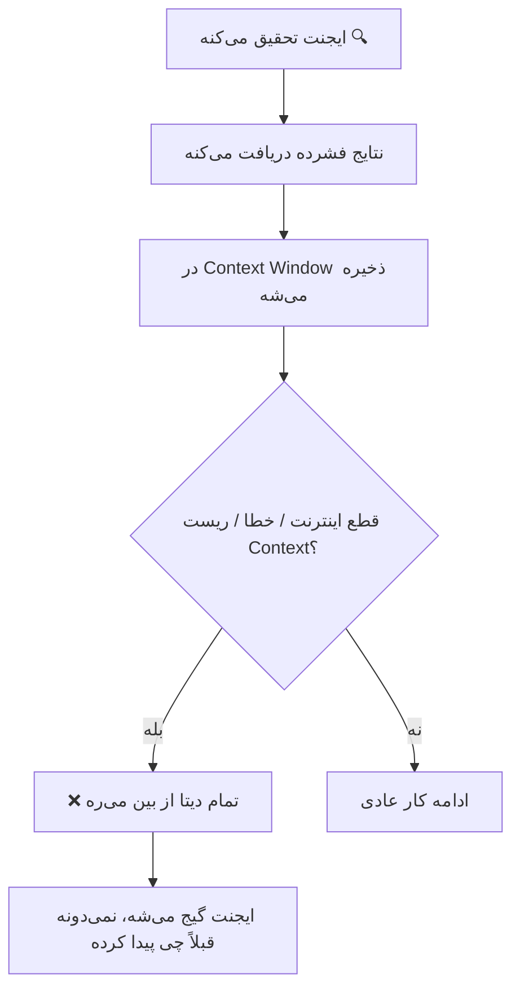
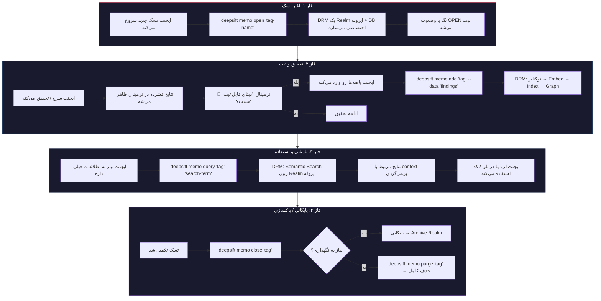
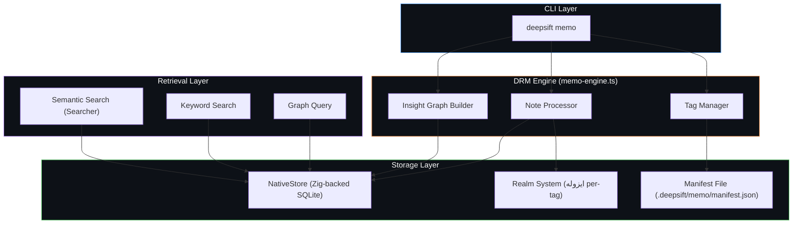
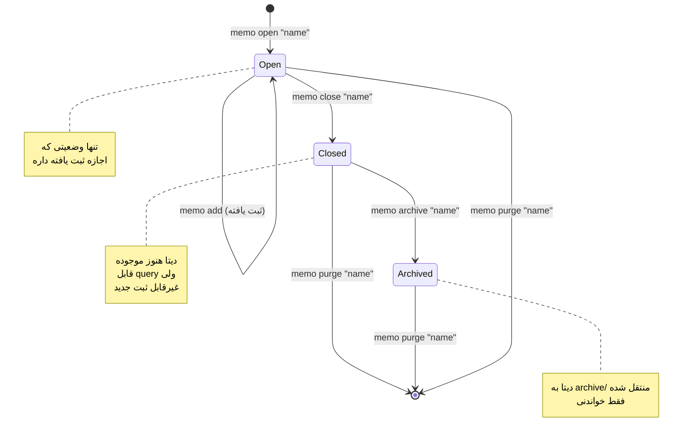

# 🧠 Dynamic Research Memory (DRM) — طرح پیاده‌سازی جامع

> **نام سیستم:** DeepSift Dynamic Research Memory (DRM)  
> **هدف:** جلوگیری از هدررفت اطلاعات تحقیقاتی ایجنت با ایجاد حافظه پویا، ایزوله و قابل‌کوئری برای هر تسک

---

## 📋 فهرست مطالب

1. [تحلیل مسئله و معماری فعلی](#1-تحلیل-مسئله)
2. [معماری کلی DRM](#2-معماری-کلی)
3. [ساختار داده‌ها و تایپ‌ها](#3-ساختار-داده‌ها)
4. [مایلستون‌های پیاده‌سازی](#4-مایلستون‌ها)
5. [جزئیات هر ماژول](#5-جزئیات-ماژول‌ها)
6. [دایرکتیو و قوانین ایجنت](#6-دایرکتیو-ایجنت)
7. [ریسک‌ها و Edge Cases](#7-ریسک‌ها)

---

## 1. تحلیل مسئله

### مشکل فعلی



### ریشه مسئله

| مشکل | توضیح |
|---|---|
| **Volatile Context** | تمام یافته‌های تحقیقاتی فقط در context window ایجنت ذخیره می‌شن — هیچ persistence وجود نداره |
| **هدررفت دیتای تصویری** | نتایج DeepSift به PNG تبدیل می‌شن و ایجنت اونا رو می‌فهمه، ولی بعد از ریست دیگه دسترسی به interpretation اون تصاویر نداره |
| **نبود Tag-based Isolation** | هیچ مکانیزمی برای گروه‌بندی یافته‌ها به تسک خاص وجود نداره |
| **عدم قابلیت Query** | history فعلی فقط لاگ ساده‌ست — قابل سرچ سمنتیک نیست |

### زیرساخت‌های موجود قابل اتکا

بررسی معماری فعلی نشون داد که این زیرساخت‌ها **آماده** هستن و DRM باید روشون سوار بشه:

| زیرساخت موجود | فایل | قابلیت |
|---|---|---|
| **Realm System** | [realm-router.ts](file:///c:/Users/ASUS/Desktop/flutter_project/mcp_search/src/core/realm-router.ts) | ایجاد دیتابیس‌های ایزوله با `NativeStore` مجزا |
| **Embedding Engine** | [embedder.ts](file:///c:/Users/ASUS/Desktop/flutter_project/mcp_search/src/core/embedder.ts) | تبدیل متن به وکتور برای سرچ سمنتیک |
| **NativeStore (Zig)** | [native-store.ts](file:///c:/Users/ASUS/Desktop/flutter_project/mcp_search/src/storage/native-store.ts) | ذخیره chunk + embedding + metadata در SQLite فشرده |
| **Searcher** | [searcher.ts](file:///c:/Users/ASUS/Desktop/flutter_project/mcp_search/src/core/searcher.ts) | سرچ هیبرید (Semantic + Keyword + RRF) |
| **Graph Builder** | [graph-builder.ts](file:///c:/Users/ASUS/Desktop/flutter_project/mcp_search/src/graphify/graph-builder.ts) | ساخت گراف از روابط بین نودها |
| **History System** | [history.ts](file:///c:/Users/ASUS/Desktop/flutter_project/mcp_search/src/utils/history.ts) | لاگ‌گذاری نتایج سرچ در INDEX.md |
| **Config System** | [config.ts](file:///c:/Users/ASUS/Desktop/flutter_project/mcp_search/src/utils/config.ts) | مدیریت Realm ها در `deepsift.config.json` |

---

## 2. معماری کلی DRM

### فلوی کامل عملیاتی



### معماری لایه‌ای DRM



---

## 3. ساختار داده‌ها و تایپ‌ها

### فایل جدید: `src/types/memo-types.ts`

```typescript
export type MemoTagStatus = 'open' | 'closed' | 'archived';

export type MemoEntryType =
    | 'finding'
    | 'code_snippet'
    | 'api_response'
    | 'architecture_note'
    | 'decision'
    | 'reference'
    | 'error_solution';

export interface MemoTag {
    id: string;
    name: string;
    status: MemoTagStatus;
    createdAt: number;
    closedAt?: number;
    description?: string;
    entryCount: number;
    realmId: string;
}

export interface MemoEntry {
    id: string;
    tagId: string;
    type: MemoEntryType;
    content: string;
    summary?: string;
    source?: string;
    relations?: string[];
    createdAt: number;
    metadata?: Record<string, string>;
}

export interface MemoManifest {
    version: number;
    tags: Record<string, MemoTag>;
    lastUpdated: number;
}

export interface MemoQueryResult {
    entry: MemoEntry;
    score: number;
    matchType: 'semantic' | 'keyword' | 'hybrid';
    tagName: string;
}

export interface MemoInsightGraph {
    nodes: MemoInsightNode[];
    edges: MemoInsightEdge[];
}

export interface MemoInsightNode {
    id: string;
    label: string;
    type: MemoEntryType;
    tagId: string;
    weight: number;
}

export interface MemoInsightEdge {
    source: string;
    target: string;
    relation: 'related_to' | 'derived_from' | 'contradicts' | 'supports' | 'extends';
    strength: number;
}
```

### ساختار فایل‌سیستم DRM

```
.deepsift/
├── memo/
│   ├── manifest.json              ← لیست تمام تگ‌ها + وضعیتشون
│   ├── tags/
│   │   ├── auth-research/
│   │   │   ├── cache.db           ← SQLite (via NativeStore) — chunks + embeddings
│   │   │   ├── graph.db           ← گراف روابط بین یافته‌ها
│   │   │   ├── entries.json       ← لیست MemoEntry ها (lightweight metadata)
│   │   │   └── summary.md        ← خلاصه خودکار (AI-generated)
│   │   ├── api-integration/
│   │   │   ├── cache.db
│   │   │   ├── graph.db
│   │   │   ├── entries.json
│   │   │   └── summary.md
│   │   └── ...
│   └── archive/                   ← تگ‌های بسته‌شده/بایگانی
│       └── old-research/
│           └── ...
```

---

## 4. مایلستون‌های پیاده‌سازی

### نمای کلی فازها

```mermaid
gantt
    title مایلستون‌های پیاده‌سازی DRM
    dateFormat X
    axisFormat %s

    section M1 - Foundation
    تایپ‌ها و مدل‌ها           :m1a, 0, 1
    MemoManifest Manager       :m1b, 1, 2
    تست بیلد                   :m1c, 2, 3

    section M2 - Tag Lifecycle
    open / close / list        :m2a, 3, 5
    purge / archive            :m2b, 5, 6
    تست بیلد                   :m2c, 6, 7

    section M3 - Note Engine
    add (parse + embed + store):m3a, 7, 10
    batch add                  :m3b, 10, 11
    تست بیلد                   :m3c, 11, 12

    section M4 - Retrieval
    query (semantic)           :m4a, 12, 14
    query (keyword + hybrid)   :m4b, 14, 15
    cross-tag search           :m4c, 15, 16
    تست بیلد                   :m4d, 16, 17

    section M5 - Insight Graph
    auto-relation detection    :m5a, 17, 19
    graph query / visualize    :m5b, 19, 20
    تست بیلد                   :m5c, 20, 21

    section M6 - CLI Integration
    memo command (all actions)  :m6a, 21, 24
    cli-entry.ts integration    :m6b, 24, 25
    تست بیلد                    :m6c, 25, 26

    section M7 - Agent Directive
    auto-prompt after search    :m7a, 26, 28
    AGENTS.md / SKILL.md update :m7b, 28, 29
    تست end-to-end              :m7c, 29, 30
```



---

## 5. جزئیات هر ماژول

### M1 — Foundation (تایپ‌ها و Manifest Manager)

#### فایل‌های جدید

| فایل | حجم تقریبی | وظیفه |
|---|---|---|
| `src/types/memo-types.ts` | ~80 خط | تمام تایپ‌ها و اینترفیس‌های DRM |
| `src/memo/manifest-manager.ts` | ~120 خط | CRUD روی manifest.json + مدیریت lifecycle تگ‌ها |

#### `manifest-manager.ts` — API اصلی

```
class MemoManifestManager:
    constructor(projectPath: string)

    createTag(name: string, description?: string): MemoTag
        ← ایجاد تگ جدید با وضعیت 'open'
        ← ساخت دایرکتوری ایزوله
        ← ثبت در manifest.json

    closeTag(tagId: string): void
        ← تغییر وضعیت به 'closed'
        ← ثبت closedAt timestamp

    archiveTag(tagId: string): void
        ← انتقال فایل‌ها به archive/
        ← تغییر وضعیت به 'archived'

    purgeTag(tagId: string): void
        ← حذف کامل دایرکتوری و تمام دیتا
        ← حذف از manifest

    getOpenTags(): MemoTag[]
        ← لیست تگ‌های با وضعیت 'open'

    getAllTags(): MemoTag[]

    getTag(tagIdOrName: string): MemoTag | undefined
        ← بازیابی تگ با ID یا نام

    getTagDbPath(tagId: string): string
        ← مسیر cache.db برای NativeStore

    getTagGraphPath(tagId: string): string
        ← مسیر graph.db
```

#### اصل طراحی: ایزوله‌سازی کامل

هر تگ یک **Realm مستقل** می‌سازه. این یعنی:
- دیتابیس SQLite مجزا (`cache.db`) → هیچ تداخلی با ایندکس اصلی پروژه نداره
- گراف مجزا (`graph.db`) → روابط یافته‌ها فقط درون همون تگ
- `entries.json` → متادیتای سبک برای لیست‌کردن سریع بدون باز کردن DB

---

### M2 — Tag Lifecycle (چرخه حیات تگ‌ها)

#### State Machine تگ‌ها



#### قانون بحرانی: فقط تگ‌های `open` اجازه ثبت دارن

وقتی ایجنت بخواد یافته‌ای ثبت کنه، اول چک می‌شه:
1. آیا تگ وجود داره؟
2. آیا وضعیتش `open` هست؟
3. اگه نه → خطای واضح برگردونه

---

### M3 — Note Engine (موتور ثبت یادداشت)

#### فایل جدید: `src/memo/note-processor.ts` (~180 خط)

```
class NoteProcessor:
    constructor(projectPath: string, manifestManager: MemoManifestManager)

    async addEntry(tagName: string, content: string, options?: {
        type?: MemoEntryType,
        source?: string,
        summary?: string,
        metadata?: Record<string, string>
    }): Promise<MemoEntry>

    فلوی داخلی addEntry:
        1. validateTag(tagName) → بررسی open بودن
        2. generateEntryId() → crypto hash
        3. parseContent(content) → تشخیص خودکار نوع (code_snippet, finding, etc.)
        4. chunkContent(content) → تیکه‌بندی محتوا (استفاده از پارسرهای موجود)
        5. embedChunks(chunks) → تولید embedding (استفاده از embedder.ts)
        6. storeChunks(tagDbPath, chunks) → ذخیره در NativeStore ایزوله
        7. updateEntries(tagId, entry) → اضافه به entries.json
        8. updateManifest(tagId) → بروزرسانی entryCount
        9. return entry

    async addBatch(tagName: string, entries: {content: string, type?: MemoEntryType}[]): Promise<MemoEntry[]>
        ← ثبت دسته‌ای (برای وقتی که ایجنت چند یافته همزمان داره)
```

#### تشخیص خودکار نوع محتوا

```
detectEntryType(content: string): MemoEntryType:
    if content شامل بلاک کد (```) → 'code_snippet'
    if content شامل "error" / "fix" / "solution" → 'error_solution'
    if content شامل URL یا reference → 'reference'
    if content شامل "decided" / "chose" / "approach" → 'decision'
    if content شامل الگوهای API (endpoint, status, response) → 'api_response'
    if content شامل الگوهای معماری (layer, module, pattern) → 'architecture_note'
    default → 'finding'
```

#### چرا `entries.json` جدا از `cache.db`؟

| `entries.json` | `cache.db` |
|---|---|
| متادیتای سبک (id, type, summary, timestamp) | محتوای کامل + embedding vectors |
| لود سریع برای `memo list` | لود سنگین فقط برای `memo query` |
| ~1KB per entry | ~50KB per entry (with vectors) |
| قابل خواندن بدون Zig Bridge | نیاز به NativeStore |

---

### M4 — Retrieval Layer (لایه بازیابی)

#### فایل جدید: `src/memo/memo-searcher.ts` (~150 خط)

```
class MemoSearcher:
    constructor(projectPath: string, manifestManager: MemoManifestManager)

    async queryTag(tagName: string, query: string, options?: {
        topK?: number,
        filterType?: MemoEntryType[]
    }): Promise<MemoQueryResult[]>

    فلوی داخلی queryTag:
        1. getTag(tagName) → بررسی وجود
        2. getStore(tagDbPath) → NativeStore ایزوله
        3. new Searcher(store).search({query, topK}) → سرچ هیبرید
        4. enrichResults(results, entries.json) → اضافه‌کردن متادیتای MemoEntry
        5. return formatted results

    async queryAllOpenTags(query: string, topK?: number): Promise<MemoQueryResult[]>
        ← سرچ در تمام تگ‌های باز (cross-tag)
        ← نتایج merge و sort by score

    async queryByType(tagName: string, type: MemoEntryType): Promise<MemoEntry[]>
        ← فیلتر entries.json بدون سرچ سمنتیک

    async getSummary(tagName: string): Promise<string>
        ← خواندن summary.md
        ← اگه نبود، تولید خلاصه از entries
```

#### نکته مهم: استفاده مجدد از `Searcher` موجود

[searcher.ts](file:///c:/Users/ASUS/Desktop/flutter_project/mcp_search/src/core/searcher.ts) در حال حاضر از `NativeStore` برای سرچ استفاده می‌کنه. چون هر تگ DRM یک `NativeStore` مجزا داره، **هیچ تغییری در Searcher لازم نیست** — فقط یک instance جدید با store تگ می‌سازیم.

---

### M5 — Insight Graph (گراف بینش)

#### فایل جدید: `src/memo/insight-graph.ts` (~150 خط)

```
class InsightGraphBuilder:
    constructor(projectPath: string)

    async buildRelations(tagId: string, entries: MemoEntry[]): Promise<MemoInsightGraph>

    فلوی داخلی:
        1. برای هر جفت entry:
           - محاسبه cosine similarity بین embedding ها
           - اگه similarity > 0.7 → edge با relation 'related_to'
        2. تشخیص الگوهای خاص:
           - اگه entry A از نوع 'error_solution' و B از نوع 'finding' باشه
             و similarity بالا → relation 'derived_from'
           - اگه entry A و B هر دو 'decision' باشن
             و محتوای متناقض داشته باشن → relation 'contradicts'
        3. محاسبه weight هر نود بر اساس تعداد edges
        4. ذخیره گراف در graph.db

    async queryGraph(tagId: string, entryId: string, depth?: number): Promise<MemoInsightNode[]>
        ← پیدا کردن نودهای مرتبط با depth مشخص

    async getGraphSummary(tagId: string): Promise<string>
        ← خلاصه گراف: تعداد نودها، edges، communities
```

#### چرا گراف مهمه؟

بدون گراف، یافته‌ها فقط یک لیست فلت هستن. با گراف:
- ایجنت می‌تونه بفهمه کدوم یافته‌ها **بهم مرتبطن**
- وقتی یه finding جدید اضافه می‌شه، **خودکار** به یافته‌های قبلی مرتبط لینک می‌شه
- موقع پلن‌نویسی، ایجنت می‌تونه **زنجیره استدلال** رو دنبال کنه

---

### M6 — CLI Integration

#### فایل جدید: `src/cli/commands/memo.ts` (~200 خط)

#### دستورات CLI جدید

```bash
deepsift memo open "auth-research" --desc "تحقیق درباره سیستم احراز هویت"
deepsift memo close "auth-research"
deepsift memo archive "auth-research"
deepsift memo purge "auth-research"

deepsift memo list                              # لیست همه تگ‌ها
deepsift memo list --open                       # فقط تگ‌های باز

deepsift memo add "auth-research" --data "یافته: Firebase Auth از JWT استفاده می‌کنه با refresh token"
deepsift memo add "auth-research" --data "..." --type code_snippet
deepsift memo add "auth-research" --file "path/to/findings.md"

deepsift memo query "auth-research" "jwt token refresh"
deepsift memo query --all "authentication"      # سرچ در تمام تگ‌های باز
deepsift memo query "auth-research" --type finding

deepsift memo show "auth-research"              # خلاصه + آمار
deepsift memo graph "auth-research"             # نمایش گراف روابط
deepsift memo export "auth-research"            # خروجی MD قابل خواندن

deepsift memo prompt                            # لیست تگ‌های باز + پرسش ثبت
```

#### تغییرات در فایل‌های موجود

##### `src/cli/cli-entry.ts` — اضافه کردن case جدید

```
case 'memo':
    const memoAction = commandArgs[0];
    const memoTarget = commandArgs[1];
    await memoCommand(projectPath, memoAction, memoTarget, commandArgs.slice(2), format);
    break;
```

##### HELP_TEXT — اضافه کردن بخش memo

```
  memo <action>                 Dynamic Research Memory (DRM)
                                  open "name"         Create a new research tag
                                  close "name"        Close a tag (no more entries)
                                  archive "name"      Archive a closed tag
                                  purge "name"        Delete tag and all data
                                  list [--open]       List all tags
                                  add "name" --data   Record a finding
                                  query "name" "q"    Search within a tag
                                  show "name"         Tag summary and stats
                                  graph "name"        Show insight graph
                                  export "name"       Export as readable MD
                                  prompt              Check open tags & ask for notes
```

---

### M7 — Auto-Prompt & Agent Directive

#### مکانیزم Auto-Prompt بعد از هر سرچ

##### تغییر در `src/cli/commands/search.ts`

بعد از هر سرچ موفق، اگه تگ باز وجود داشته باشه:

```
const openTags = manifestManager.getOpenTags();
if (openTags.length > 0) {
    const tagNames = openTags.map(t => t.name).join(', ');
    printInfo(`\n📝 Open memo tags: [${tagNames}]`);
    printInfo(`💡 Notable findings? Use: deepsift memo add "<tag>" --data "<your findings>"`);
}
```

#### این prompt چطور کار می‌کنه در عمل:

```
$ deepsift search "firebase auth implementation"

✔ Found 8 results (hybrid search)
[... نتایج فشرده ...]

📝 Open memo tags: [auth-research]
💡 Notable findings? Use: deepsift memo add "auth-research" --data "<your findings>"
```

ایجنت این پیام رو می‌بینه و **تصمیم می‌گیره** آیا یافته‌ای ارزش ثبت داره یا نه.

#### بروزرسانی Agent Directive (AGENTS.md + SKILL.md)

قوانین جدیدی که باید به دایرکتیو ایجنت اضافه بشن:

```markdown
## 📝 Dynamic Research Memory Protocol (DRM)

### قانون ۱: باز کردن تگ قبل از هر تسک تحقیقاتی
قبل از شروع هر تسک که شامل تحقیق، سرچ، یا جمع‌آوری اطلاعات باشه:
- `deepsift memo open "<task-name>"` اجرا کن
- نام تگ باید توصیفی و مرتبط با تسک باشه

### قانون ۲: ثبت یافته‌های مهم بعد از هر سرچ
بعد از هر `deepsift search` موفق که نتایج مفید داره:
- اگه ترمینال پیام "Open memo tags" نشون داد
- یافته‌های کلیدی رو با `deepsift memo add` ثبت کن
- شامل: الگوهای کد، تصمیمات معماری، API signatures، خطاها و راه‌حل‌ها

### قانون ۳: استفاده از حافظه قبل از پلن‌نویسی
قبل از نوشتن implementation plan:
- `deepsift memo query "<tag>" "<relevant-query>"` اجرا کن
- تمام یافته‌های مرتبط رو review کن
- از اطلاعات ثبت‌شده در پلن استفاده کن

### قانون ۴: بستن تگ بعد از تکمیل تسک
بعد از تکمیل موفق تسک:
- `deepsift memo close "<tag>"` اجرا کن
- اگه دیگه نیازی به دیتا نیست: `deepsift memo purge "<tag>"`
```

---

## 6. ساختار نهایی فایل‌ها

### فایل‌های جدید (7 فایل)

| فایل | خطوط | وظیفه |
|---|---|---|
| `src/types/memo-types.ts` | ~80 | تایپ‌ها و اینترفیس‌ها |
| `src/memo/manifest-manager.ts` | ~150 | مدیریت lifecycle تگ‌ها |
| `src/memo/note-processor.ts` | ~180 | پردازش و ذخیره یادداشت‌ها |
| `src/memo/memo-searcher.ts` | ~150 | سرچ و بازیابی |
| `src/memo/insight-graph.ts` | ~150 | ساخت گراف روابط |
| `src/memo/memo-engine.ts` | ~100 | Facade (ارکستراسیون تمام اجزا) |
| `src/cli/commands/memo.ts` | ~200 | دستورات CLI |

### فایل‌های تغییریافته (3 فایل)

| فایل | تغییر |
|---|---|
| `src/cli/cli-entry.ts` | اضافه شدن import + case 'memo' |
| `src/cli/commands/search.ts` | اضافه شدن auto-prompt بعد از نتایج |
| `src/types/index.ts` | re-export memo-types |

### ساختار پوشه‌بندی نهایی

```
src/
├── memo/                          ← ✨ ماژول جدید
│   ├── manifest-manager.ts
│   ├── note-processor.ts
│   ├── memo-searcher.ts
│   ├── insight-graph.ts
│   └── memo-engine.ts
├── cli/
│   └── commands/
│       └── memo.ts                ← ✨ فایل جدید
├── types/
│   ├── index.ts                   ← 🔧 تغییر جزئی
│   └── memo-types.ts              ← ✨ فایل جدید
└── ...
```

---

## 7. ریسک‌ها و Edge Cases

### ریسک‌های فنی

| ریسک | احتمال | شدت | راهکار |
|---|---|---|---|
| **حجم بالای دیتا در یک تگ** | متوسط | بالا | محدودیت 500 entry per tag + هشدار |
| **تداخل با ایندکس اصلی** | پایین | بحرانی | ایزوله‌سازی کامل با DB جدا — هیچ اشتراکی با realm `code` ندارن |
| **مصرف حافظه embedding** | متوسط | متوسط | استفاده از batch embedding موجود + محدودیت اندازه ورودی |
| **manifest.json corruption** | پایین | بالا | backup خودکار قبل از هر write + atomic write |
| **رشد بی‌رویه archive** | متوسط | پایین | `memo purge` برای پاکسازی + هشدار حجم |

### Edge Cases

| سناریو | رفتار مورد انتظار |
|---|---|
| ایجنت تگ رو باز می‌کنه ولی هیچ‌وقت نمی‌بنده | هشدار بعد از ۲۴ ساعت بی‌فعالیتی |
| دو تگ با نام یکسان | خطا: "Tag already exists" |
| سرچ در تگ خالی | پیام: "No entries in this tag yet" |
| ثبت محتوای خیلی بزرگ (>50KB) | تقسیم خودکار به چند chunk |
| ثبت در تگ closed | خطا: "Tag is closed. Open it first or create a new one" |
| حذف تگ در حال استفاده | تأیید صریح لازمه |

---

## 8. مثال کامل End-to-End

```bash
# ایجنت تسک جدید شروع می‌کنه
$ deepsift memo open "payment-integration" --desc "تحقیق درباره اتصال به درگاه پرداخت"
✔ Tag 'payment-integration' created (status: OPEN)

# ایجنت تحقیق می‌کنه
$ deepsift search "stripe payment API integration flutter"
✔ Found 12 results
📝 Open memo tags: [payment-integration]
💡 Notable findings? Use: deepsift memo add "payment-integration" --data "..."

# ایجنت یافته‌هاش رو ثبت می‌کنه
$ deepsift memo add "payment-integration" --data "Stripe SDK for Flutter uses stripe_flutter package. Key classes: Stripe.instance, PaymentSheet, PaymentIntent. Server-side needs secret key for creating PaymentIntents."
✔ Entry added to 'payment-integration' (type: finding, chunks: 3)

$ deepsift memo add "payment-integration" --data "Error: 'StripeException: No payment sheet has been initialized'. Fix: Must call Stripe.instance.initPaymentSheet() before presentPaymentSheet()" --type error_solution
✔ Entry added to 'payment-integration' (type: error_solution, chunks: 2)

# بعداً، ایجنت نیاز به اطلاعات قبلی داره
$ deepsift memo query "payment-integration" "payment initialization"
✔ Found 2 relevant entries:

  [1] (score: 0.89, type: error_solution)
  Error: 'StripeException: No payment sheet has been initialized'
  Fix: Must call Stripe.instance.initPaymentSheet() before presentPaymentSheet()

  [2] (score: 0.72, type: finding)
  Stripe SDK for Flutter uses stripe_flutter package...

# ایجنت خلاصه تگ رو می‌بینه
$ deepsift memo show "payment-integration"
📋 Tag: payment-integration (OPEN)
   Created: 2026-07-18 22:00
   Entries: 5 (3 findings, 1 error_solution, 1 code_snippet)
   Graph: 8 nodes, 4 edges

# تسک تموم شد
$ deepsift memo close "payment-integration"
✔ Tag 'payment-integration' closed.

# دیگه لازم نیست
$ deepsift memo purge "payment-integration"
⚠️ This will permanently delete all data. Confirm? (y/n): y
✔ Tag 'payment-integration' purged.
```

---

## 9. خلاصه تصمیمات معماری کلیدی

| تصمیم | دلیل |
|---|---|
| **استفاده از NativeStore (Zig) برای هر تگ** | عملکرد بالا + سازگاری ۱۰۰٪ با سیستم سرچ موجود |
| **Manifest جدا از DB** | لود سریع لیست تگ‌ها بدون باز کردن DB سنگین |
| **entries.json جدا** | متادیتای سبک قابل خواندن بدون ZigBridge |
| **Auto-prompt در search.ts** | کمترین اصطکاک — ایجنت خودش تصمیم می‌گیره |
| **گراف ایزوله per-tag** | هر تحقیق context مستقل خودش رو داره |
| **ماژول `memo/` جدا از `core/`** | SoC: حافظه تحقیقاتی مسئولیت متفاوتی از ایندکس‌سازی کد داره |

> [!IMPORTANT]
> این سیستم **هیچ تغییری** در لایه ذخیره‌سازی اصلی (`NativeStore`, `ZigBridge`) یا موتور سرچ (`Searcher`) نمی‌ده. فقط instance‌های جدید از اونا می‌سازه با مسیرهای DB متفاوت.

---

> [!TIP]
> برای شروع پیاده‌سازی، مایلستون M1 (تایپ‌ها + ManifestManager) کوچکترین واحد قابل بیلد هست و می‌تونه مستقل تست بشه.
